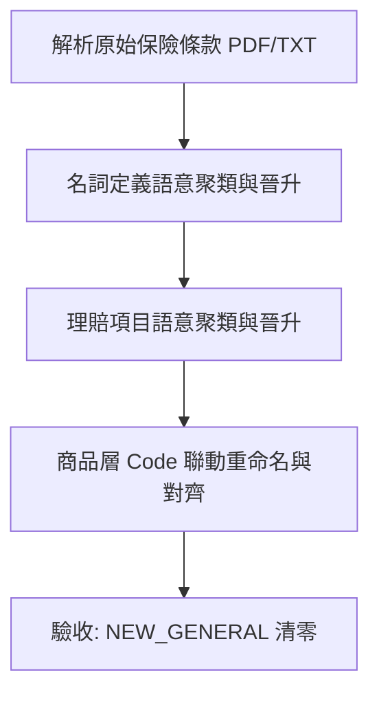

# 專案上下文 (Project Context)

## 專案概述
本專案是一個保險業 ETL (Extract, Transform, Load) 工具，旨在從保險條款、費率表等文件中提取結構化數據，特別是保費計算相關的定義與數值。

## 核心功能
1. **保費提取 (Premium Extraction)**: 使用 `premium_extractor.py` 從 PDF 或圖片中提取費率表。
2. **名詞定義管理 (Definition Management)**: 
    - **資料結構**: 包含 `type` (固定為名詞定義), `description` (摘要), `code`, `display_name`, `base_definition`, `level`, `classification` 等。
    - **分層機制**: 分為「基本層 (Base)」與「商品層 (Product)」。
    - **基本層**: 基於示範條款，存放於 `data/definitions/base.json`。
    - **商品層**: 基於商品特約，存放於 `data/definitions/products/{CODE}.json`。
    - **覆蓋邏輯**: 商品層定義在運行時會覆蓋同名的基本層定義，避免汙染。

## 技術棧
- **語言**: Python 3
- **AI 模型**: Google Gemini (使用 `google-genai` SDK)
- **主要依賴**: `pypdf`, `google-genai`

## 目錄結構規範
- `src/`: 主要邏輯程式碼。
    - `pipeline/`: 多階段 Agent 核心邏輯（包含 5 大 Agent）。
    - `run_pipeline.py`: 自動化 Pipeline 啟動入口與即時後處理串接。
    - `manager.py`: 名詞定義與理賠項目的管理中心。
    - `diagnose_parameters.py`: 參數來源自動診斷與標記引擎。
    - `check_classification.py`: 分類正確性抽樣檢查工具。
- `tests/`: 單元測試與整合測試。
- `docs/`: 說明文件、架構圖與 API 文件。
- `data/`: 存放處理後的結構化數據。
- `product/`: 預設的 PDF/TXT 輸入目錄。

## 功能模組說明 (src/ 核心功能)

### 1. 多階段 Agent Pipeline (`src/pipeline/`)
本專案採用五階段 Agent 協作模式，以確保複雜保險條款的提取精準度：
- **Agent 1: Segmenter (定位員)**: 負責在長文件中精確定位相關條款或給付項目區塊。
- **Agent 2: Registry (註冊員)**: 將定位到的文本轉化為結構化的基本定義與邏輯框架。
- **Agent 3: Logic Parser (邏輯解析員)**: 深入解析條款中的數學邏輯、給付倍數與計算公式。
- **Agent 4: Param Builder (參數建構員)**: 根據解析出的邏輯，提取並正規化所有輸入參數（如年齡、職業等級）。
- **Agent 5: Lookup Modeler (查表模型建構員)**: 將參數與邏輯封裝成可供程式呼叫的查表模型或計算邏輯。

### 2. 管理與提取工具
- **`manager.py`**: 提供用於合併、推播與管理 `base_{definition/claim_items}.json` 與產品專屬的定義檔。
- **`extractor.py` / `definition_extractor.py`**: 針對特定任務（如名詞定義提取）的專用工具。

## Pipeline 啟動指南

### 環境準備
確保已安裝必要依賴：
```bash
pip install -r requirements.txt
```
*(註：若無 requirements.txt，請確保安裝 `pypdf`, `pymupdf`, `google-genai`)*

### 啟動指令
使用 `run_pipeline.py` 啟動自動化處理流程：

```bash
python src/run_pipeline.py --input-dir ./product --level PRODUCT
```

### 常用參數說明
- `--input-dir`: 指定輸入文件（PDF 或 TXT）的目錄，預設為 `./product`。
- `--output-dir`: 指定 JSON 結果的輸出路徑，預設為 `./data/claim_items/products`。
- `--level`: 設定知識層級，可選 `BASE` (通用) 或 `PRODUCT` (商品專屬)。

### 工作流程
1. 將待處理的 PDF 或 TXT 檔案放入 `product/` 目錄。
2. 執行啟動指令。
3. 程式會自動進行 PDF 前處理（含 OCR 修正）、多階段 Agent 處理。
4. 最終結果將以 JSON 格式儲存於 `data/claim_items/products/{檔案名}.json`。

## 當前任務 (已完成)
- **理賠項目批次對齊與收攏 PoC**：成功完成 `scratch/cluster_claim_items.py`（兩階段去重、自癒 Fallback 向量化、Complete Linkage 聚類、同義詞自動擴充）及 `manager.py batch-promote`（聯動修改商品層 JSON 對齊標準 Code）開發，成功將 815 筆 NEW_GENERAL 清零對齊。
- **參數來源自動診斷與標記引擎**：已完成開發、測試並整合為 Pipeline 即時後處理器，成功修復 170 個 JSON 檔案共 23,005 個變數，實現公式連鎖更名與三向標記。
- **分類正確性抽樣檢查工具**：已升級支援理賠給付項目，實測抽樣一致率達到 100%。

## 下一個任務
1. **大批量全自動 Pipeline 驗證**: 批次執行 `src/run_pipeline.py` 處理所有 160+ 商品 PDF，驗證整體分類一致率 $\ge 95\%$ 品質指標。
2. **費率與條款參數整合 (Data Context Bridge)**: 
    - 參考實作規畫 [rate_integration_plan.md](file:///c:/Users/User/Downloads/保費試算/docs/rate_integration_plan.md)。
    - 強制規範 Param Builder 與 Lookup Modeler 的輸入/輸出欄位名稱。
    - 實作維度語意對齊字典與 Lookup 區間範圍查詢解析器。
    - 預期效益: 防止因獨立指令碼（如 `premium_extractor.py`）導致的欄位命名不一致、避免上下文斷鏈，確保條款邏輯與費率表能精確映射以進行試算。
3. **計算與試算引擎開發 (Actuarial Calculation Engine)**:
    - 串接 UAP (Unified Actuarial Package)，實作動態的保費試算與理賠給付試算。

---

## 標準開發與對齊工作流 (Standard Alignment Workflow)

為了維持整個系統資料的高度一致性與命名空間的統一，條款詞庫整理流程必須嚴格遵循 **「先名詞定義，後理賠項目」** 的雙層對齊工作流：



### 1. 階段一：名詞定義對齊
* **目的與原因**：理賠項目中的公式表達式、Python eval 邏輯與變數參數（parameters）多高度依賴於名詞定義中的標準變數代號（例如 `SUM_INSURED`、`HOSPITALIZATION_DAYS`）。若先對齊理賠項目，會因為名詞定義代號混亂（如 `INSURANCE_AMOUNT` v.s. `SUM_INSURED`）而導致理賠公式映射斷鍵。因此，名詞定義必須先標準化。
* **步驟**：
  1. 執行 `python src/cluster.py --target definition`：
     - **字面去重**：以名稱 + 描述進行文字精確比對，減少 Embedding API 調用次數。
     - **語意聚類**：調用 Embedding API，並以 Complete Linkage 準則（餘弦相似度 $\ge 0.85$）將碎片化名詞定義聚集成語意群組。
     - **同義詞擴充**：自動收集 Cluster 中所有成員的 display_name 寫入代表項目的 `synonym_map` 中，充實基底詞庫，防止未來 Pipeline 重複產生 `NEW_GENERAL`。
  2. 執行 `python src/manager.py --target definition batch-promote data/definitions/definition_clusters.json --auto`：
     - 將代表項目晉升至對應險種的基底 JSON 中，並執行跨詞庫去重。
     - **商品聯動更新**：自動逐筆讀取 Cluster 內所有成員來源商品 JSON 檔案，利用原始 Code 或 DisplayName 雙重匹配，強制將商品層項目重命名為標準的代表項目 Code，並改為 `EXISTING_MATCH` 狀態。

### 2. 階段二：理賠給付項目對齊
* **目的與原因**：利用去重與 Embedding 語意聚類，解決不同商品間 display_name 描述高度碎片化的問題（815 筆收縮至 115 類），並進行商品層 JSON 代號的聯動重命名修正。
* **步驟**：
  1. 執行 `python src/cluster.py --target claim_item`：
     - **字面去重**：以名稱 + 描述進行文字精確比對，減少 Embedding API 運算量。
     - **語意聚類**：調用 Embedding API，並以 Complete Linkage 準則（餘弦相似度 $\ge 0.85$）將理賠給付聚集成核心群組。
     - **同義詞擴充**：自動收集 Cluster 中所有成員的 display_name 寫入代表項目的 `synonym_map` 中。
  2. 執行 `python src/manager.py --target claim_item batch-promote data/claim_items/claim_item_clusters.json --auto`：
     - 將代表項目晉升至對應險種的基底 JSON 中，並執行跨詞庫去重。
     - **商品聯動更新**：自動逐筆讀取 Cluster 內所有成員來源商品 JSON 檔案，利用原始 Code 或 DisplayName 雙重匹配，強制將商品層項目重命名為標準的代表項目 Code，並改為 `EXISTING_MATCH` 狀態。
  3. 驗收清零：分別執行：
     - `python src/manager.py --target definition list`
     - `python src/manager.py --target claim_item list`
     確認所有標記為 `NEW_GENERAL` 的項目已完全清零。
