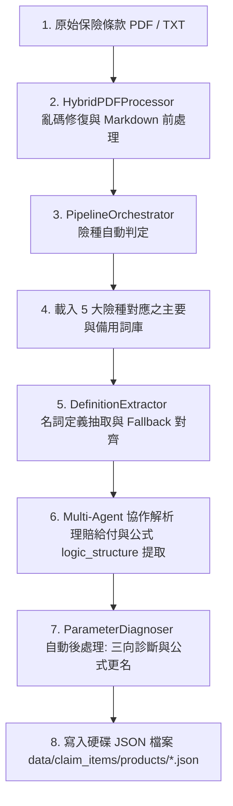
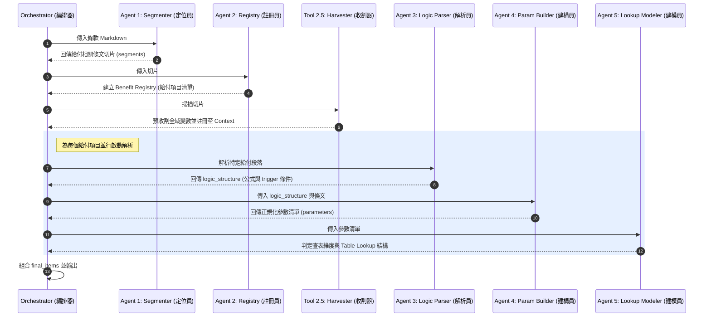
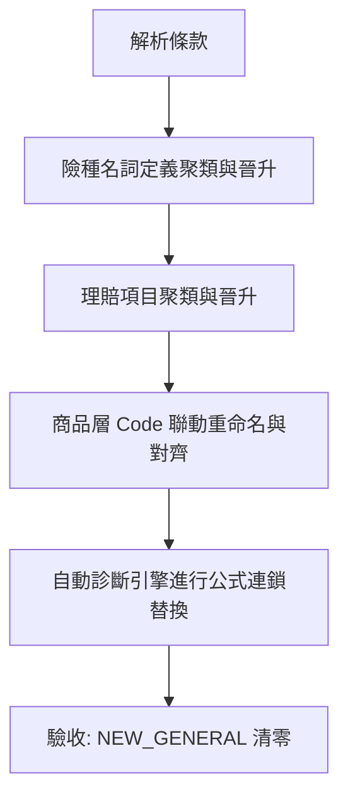

## 📖 目錄
1. [專案功能與解決痛點](#1-專案功能與解決痛點)
2. [系統核心架構與解析管線 (Architecture & Pipeline)](#2-系統核心架構與解析管線-architecture--pipeline)
3. [多階段 Agent 協作機制 (Multi-Agent Collaboration)](#3-多階段-agent-協作機制-multi-agent-collaboration)
4. [標準雙層詞庫對齊工作流 (Alignment Workflow)](#4-標準雙層詞庫對齊工作流-alignment-workflow)
5. [核心腳本操作指南](#5-核心腳本操作指南)
   - [5.1 多階段 Pipeline 執行入口 (`src/run_pipeline.py`)](#51-多階段-pipeline-執行入口-srcrun_pipelinepy)
   - [5.2 參數來源診斷與標記引擎 (`src/diagnose_parameters.py`)](#52-參數來源診斷與標記引擎-srcdiagnose_parameterspy)
   - [5.3 分類正確性抽樣檢查工具 (`src/check_classification.py`)](#53-分類正確性抽樣檢查工具-srccheck_classificationpy)
   - [5.4 名詞定義與理賠項目管理中心 (`src/manager.py`)](#54-名詞定義與理賠項目管理中心-srcmanagerpy)
   - [5.5 批次語義聚類與去重工具 (`src/cluster.py`)](#55-批次語義聚類與去重工具-srcclusterpy)

---

## 1. 專案功能與解決痛點

在保險商品（如健康險、傷害險、壽險）的試算與精算系統開發中，面臨著兩大核心痛點：
1. **條款碎片化與語意多變**：不同保險公司對同一個精算概念描述不一（例如：把「保險金額」寫成「保額」、「投保金額」），導致前端精算計算時因變數名稱無法對齊而發生「變數找不到定義」的斷鍵錯誤。
2. **精算公式極其複雜**：理賠給付的觸發條件、給付倍數與附表查表邏輯散落在長達數十頁的 PDF 條款中，人工整理費時且極易出錯。

### 核心功能
本系統為一套 AI 驅動的保險條款 ETL (Extract, Transform, Load) 自動化管線，能夠：
* **自動抽取**：從 PDF 條款中自動精確提取名詞定義、給付條件、精算邏輯表示式與查表維度。
* **雙層詞庫對齊**：依據名詞定義與理賠項目進行雙層語意聚類，自動收攏變體代號，將商品層與基底層詞庫完美對齊。
* **自動診斷修復**：即時分析參數來源，並對命名不一致的變數進行公式連鎖更新，出廠即為 100% 正確的結構化精算 JSON 資料。

---

## 2. 系統核心架構與解析管線 (Architecture & Pipeline)

本系統將商品條款從原始 PDF 轉化為結構化精算 JSON，其端到端資料管線架構如下：



---

## 3. 多階段 Agent 協作機制 (Multi-Agent Collaboration)

在「6. Multi-Agent 協作解析」階段，系統採用 5 階段 Agent 與 1 個 Harvesting 工具協同作業，確保複雜精算公式的提取精準度：



---

## 4. 標準雙層詞庫對齊工作流 (Alignment Workflow)

為了維持整個系統資料的一致性，詞庫整理流程嚴格遵循 **「先名詞定義，後理賠項目」** 的雙層對齊工作流。在對齊時，我們優先與主要險種庫對齊，若未命中則循序使用備用庫 Fallback：



* **先名詞後給付的原因**：理賠給付的計算公式與參數高度依賴名詞定義中的標準代號（如 `SUM_INSURED`）。若名詞代號混亂，會導致理賠公式映射斷鍵，因此名詞必須先標準化。

---

## 5. 核心腳本操作

### 5.1 多階段 Pipeline 執行入口 (`src/run_pipeline.py`)

#### 💡 功能與工作原理
執行整個商品提取 ETL 的入口。它呼叫 `HybridPDFProcessor` 將 PDF 重建為乾淨的 Markdown，經由 Orchestrator 進行 Multi-Agent 協作解析，最後經由後處理器自動在記憶體中進行三向標記與公式修正，輸出標準精算 JSON。

#### ⚙️ 命令列參數說明
```bash
python src/run_pipeline.py --input-dir ./product --level PRODUCT
```
* `--input-dir` : 指定輸入檔案（PDF / TXT）目錄，預設為 `./product`。
* `--output-dir`: 指定結果儲存路徑，預設為 `./data/claim_items/products`。
* `--level`     : 知識層級，可選 `BASE` (通用) 或 `PRODUCT` (商品專屬，預設)。
* `--definitions`: **僅提取名詞 Flag**。開啟後僅做名詞提取，略過後續理賠項目與 Agent 運算，可節省約 90% 的 API Token 成本與時間。

---

### 5.2 參數來源診斷與標記引擎 (`src/diagnose_parameters.py`)

#### 💡 功能與工作原理
此腳本為資料品質的防禦引擎，提供唯讀掃描與自動修復兩種模式。它能判定 parameters 的來源類型並寫入 `source_type` 欄位，同時更正與名詞定義不一致的英文 Code。

#### 🧠 三向診斷預測邏輯
1. **`DEFINITION_ALIGN` (名詞對齊變數)**：參數代號或中文名稱匹配名詞定義庫的標準 `code` / `display_name`。
2. **`SYSTEM_DERIVED` (系統衍生變數)**：參數為內建系統變數（如 `policy_year`）或 `binding_type` 為 `SYSTEM_CALCULATED`/`POLICY_FIXED`。
3. **`USER_INPUT` (外生輸入變數)**：不符合前兩者，需由使用者在試算時手動輸入的外生變數。

#### 實作
* **唯讀檢測並輸出警示報告**：
  ```bash
  python src/diagnose_parameters.py
  ```
* **自動修復並連鎖更新 JSON 檔案**：
  ```bash
  python src/diagnose_parameters.py --fix
  ```
  *(注：修復時，會連帶使用 `\b` 單字邊界正則匹配，同步將 logic_structure 中所有引用的變數連鎖替換，杜絕斷鍵)*

---

### 5.3 分類正確性抽樣檢查工具 (`src/check_classification.py`)

#### 💡 功能與工作原理
本腳本是語義分類的隨機覆核工具。它隨機抽選 10% 的項目，呼叫 Gemini API 重新判定其險種分類，輸出「分類一致率報告」，做為 Pipeline 險種判定是否達標（$\ge 95\%$ 一致率）的驗收依據。

#### 實作
* **隨機抽選名詞定義進行語義覆核**：
  ```bash
  python src/check_classification.py --target definition
  ```
* **隨機抽選理賠項目進行語義覆核**：
  ```bash
  python src/check_classification.py --target claim_item
  ```

---

### 5.4 名詞定義與理賠項目管理中心 (`src/manager.py`)

#### 💡 功能與工作原理
提供命令列工具以管理 `NEW_GENERAL` 的候選項目。精算管理人員可以對其進行晉升、跨庫去重搬移或聯動更新。

#### 實作
* **列出目前所有待審核的 `NEW_GENERAL` 代碼**：
  ```bash
  python src/manager.py --target claim_item list
  ```
* **互動式晉升單一項目至基底層，並自動同步成員商品**：
  ```bash
  python src/manager.py --target claim_item promote DEATH_BENEFIT
  ```
* **重新調整既存項目的分類子詞庫或從中刪除**：
  ```bash
  python src/manager.py --target definition reclassify BASIC_SUM_INSURED
  ```
* **自動化批次晉升聚類結果群組**：
  ```bash
  python src/manager.py --target claim_item batch-promote data/claim_items/claim_item_clusters.json --auto
  ```

---

### 5.5 批次語義聚類與去重工具 (`src/cluster.py`)

#### 💡 功能與工作原理
當 Pipeline 處理大量商品產生數百個 `NEW_GENERAL` 給付項目時，本工具先透過 display_name 做字面去重，再呼叫 Gemini Embedding API 將文字向量化，並採用 **Complete Linkage（最長距離）層次聚類演算法** 進行分群，將相似度 $\ge 0.85$ 的項目歸併成一個群組，同時進行 `synonym_map` 同義詞擴充，從源頭上防止未來再次產生重複的 `NEW_GENERAL`。

#### 實作
```bash
python src/cluster.py --target claim_item
```
*執行完成後，會於 `data/` 下產出聚類結果 JSON 檔，供 `manager.py batch-promote` 進行批量晉升對齊。*
