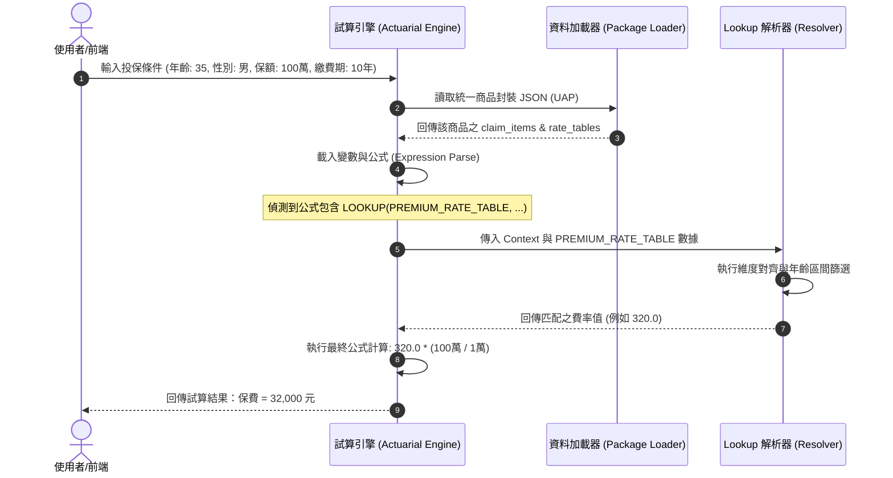
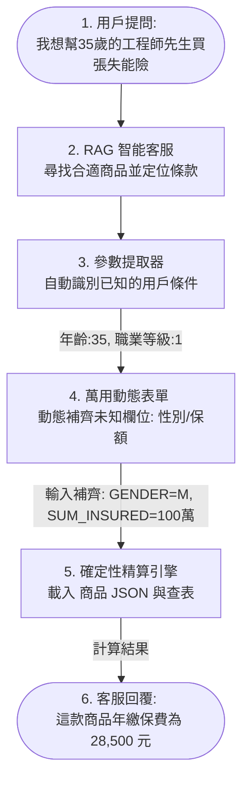

# 費率與條款參數整合設計

本文件規劃將現行靜態的費率表解析模組 (`premium_extractor.py`) 與動態的名詞定義 (`definitions`)、理賠項目 (`claim_items`)、以及變數參數 (`parameters`) 進行端到端 (End-to-End) 的整合，以建構出可執行的「保費與理賠試算引擎」。

---

## 1. 現況痛點分析

目前專案的條款解析與費率解析各自獨立，存在以下三個核心斷鏈點：

1. **命名斷鏈**:
   - `premium_extractor.py` (Agent B) 輸出的 `rate_blocks` 欄位鍵名（如 `premium_period`, `occupation_level` 等）是根據 PDF 直接產生的。
   - `claim_items` 中的參數名稱則是經過名詞定義對齊後的標準變數代號（如 `PAYMENT_PERIOD`, `OCCUPATION_CLASS`）。
   - **後果**：計算引擎在執行公式時，會因為變數名稱不一致而發生 `KeyError` 斷鏈。

2. **區間查表斷鏈**:
   - 費率表是以 `age_start` 到 `age_end` (區間) 儲存年齡費率（如 `0-4` 歲）。
   - 條款參數與使用者輸入則通常為單一整數（如 `INSURANCE_AGE = 3`）。 
   - **規格**：須透過區間比對解析。

3. **計算與查表邏輯的封裝缺失**:
   - Agent 5 判定出給付項目公式中包含 `LOOKUP(Table, {Dim1, Dim2})`。但目前僅停留在靜態描述，缺乏一個 Lookup 執行器能在運行時載入 `rate_table` 資料並完成計算。

---

## 2. 整合架構設計

為了打通條款參數與費率表，以下是 **三大整合機制**：

```mermaid
graph TD
    subgraph 原始數據源
        PDF[商品 PDF & 費率 PDF]
    end

    subgraph 解析管線 (ETL Pipeline)
        A[run_pipeline.py <br>名詞與理賠解析] -->|產生| B[claim_items.json <br>含標準參數與公式]
        C[premium_extractor.py <br>費率解析] -->|產生| D[rate_blocks.json <br>含維度與費率]
    end

    subgraph 語義對齊層 (Semantic Bridge)
        Registry[維度對齊註冊表 <br>dimension_alignment.json]
        Registry -->|自動轉換| Engine
    end

    subgraph 試算與計算引擎 (Actuarial Engine)
        Input[使用者輸入 <br>年齡、性別、保額] --> Engine[Lookup 執行引擎 <br>Lookup Resolver]
        B --> Engine
        D --> Engine
        Engine -->|公式 eval 與查表| Payout[輸出：試算保費 / 理賠金額]
    end
```

### 2.1 維度語意對齊表

建立標準對照配置作為費率表屬性與標準名詞 Code 的對照, 範例:

```json
{
  "rate_table_dimensions": {
    "gender": {
      "standard_code": "GENDER",
      "mapping": {
        "M": "MALE",
        "F": "FEMALE",
        "BOTH": "BOTH"
      }
    },
    "premium_period.value": {
      "standard_code": "PAYMENT_PERIOD"
    },
    "occupation_level": {
      "standard_code": "OCCUPATION_CLASS"
    },
    "age_range": {
      "standard_code": "INSURANCE_AGE",
      "resolver": "range_match"
    }
  }
}
```

### 2.2 區間查詢解析器

設計一個 Python class 負責處理計算中的 Lookup 動作。其核心邏輯如下：

```python
class LookupResolver:
    def __init__(self, rate_table: list, alignment_config: dict):
        self.rate_table = rate_table
        self.alignment = alignment_config

    def resolve(self, context: dict) -> float:
        """
        context 範例: {
            "INSURANCE_AGE": 35,
            "GENDER": "MALE",
            "OCCUPATION_CLASS": 2,
            "PAYMENT_PERIOD": 10
        }
        """
        filtered_blocks = self.rate_table
        
        # 1. 根據標準對齊進行過濾
        # 過濾性別
        gender_input = context.get("GENDER")
        filtered_blocks = [
            b for b in filtered_blocks 
            if b.get("gender") == "BOTH" or b.get("gender") == self._reverse_gender(gender_input)
        ]
        
        # 過濾繳費期間
        pay_period = context.get("PAYMENT_PERIOD")
        filtered_blocks = [
            b for b in filtered_blocks 
            if b.get("premium_period", {}).get("value") == pay_period
        ]
        
        # 過濾職業等級
        occ_class = context.get("OCCUPATION_CLASS", 0)
        filtered_blocks = [
            b for b in filtered_blocks 
            if b.get("occupation_level") == 0 or b.get("occupation_level") == occ_class
        ]
        
        # 2. 進行年齡區間匹配 (Range Match)
        age = context.get("INSURANCE_AGE")
        for record in filtered_blocks:
            if record.get("age_start") <= age <= record.get("age_end"):
                return record.get("premium")
                
        raise ValueError(f"無法在費率表中找到對應條件的費率: {context}")
```

### 2.3 統一商品封裝

不再將費率表與條款解析分開儲存，而是在 Pipeline 最終輸出時，將其融合為單一的商品 JSON：

```json
{
  "product_code": "206121MA4B30122A11Z10000000-A",
  "product_name": "南山人壽大樂選利率變動型還本保險（定期給付型）",
  "metadata": { ... },
  "definitions": [ ... ],
  "claim_items": [
    {
      "code": "SURVIVAL_BENEFIT",
      "logic_structure": {
        "formula_template": {
          "expression": "LOOKUP(PREMIUM_RATE_TABLE, {INSURANCE_AGE, GENDER, OCCUPATION_CLASS}) * (BASIC_SUM_INSURED / 10000)"
        }
      }
    }
  ],
  "rate_tables": {
    "PREMIUM_RATE_TABLE": [
      {
        "gender": "M",
        "age_start": 30,
        "age_end": 34,
        "occupation_level": 0,
        "premium_period": { "type": "YEAR", "value": 10 },
        "premium": 320.0
      }
    ]
  }
}
```

---

## 3. 整合後的端到端工作流

以下是當使用者進行保費/理賠試算時，系統的運作順序：



---

## 4. 下一步實作優先序

1. **[x] 定義統一的 JSON Schema**: 融合成商品 JSON 格式。
2. **[x] 開發維度對齊模組**: 已透過動態 Schema 調整 (`_build_dynamic_schema`) 與 Pipeline 入口 hints 傳遞自動完成。
3. **[ ] 實作計算引擎核心**: 撰寫 Python 式的運算引擎，能動態載入商品 JSON、解析 DSL / Python 運算式，並提供 `LOOKUP` 與範圍查詢（區間比對）能力。
4. **[ ] 撰寫計算引擎單元測試**: 建立對應的計算與範圍查表單元測試，提供模擬測資驗證。


## 5. 未來應用與藍圖

### 核心理念：將 檢索 與 運算 分離
在現行的業務工具中，有一個以 **RAG為基礎的智能客服** 作為與保戶或業務員對話的入口。但保險試算需要 100% 的精確度，AI不擅長進行複雜的精算與查表，讓 AI 運算會有數字幻覺。

本專案的核心戰略在於**將檢索與運算完全分離**：
1. **AI 負責檢索**：理解用戶模糊的自然語言需求，推薦合適的保險商品，並定位條款。
2. **UAP 負責運算**：條款與費率經一次性 ETL 解析，儲存為固定結構的 商品JSON。系統加載此 JSON，由確定的程式代碼執行查表與公式計算，保證計算結果 100% 精準。



---

### 場景 1：對話式智能客服引導與試算 (理想場景)
* **用戶情境**：用戶問：「我想推薦 35 歲、當工程師的先生買一張可以保障失能，且有生存金的台灣人壽保單。」
* **運作機制**：
  1. 客服 RAG 鎖定目標商品，同時系統偵測到用戶提問中已含部分參數：`INSURANCE_AGE = 35`、`OCCUPATION_CLASS = 1`。
  2. 系統後台讀取該商品的JSON，分析其 `claim_items` 公式所需的 parameters 發現還缺少 `GENDER` (性別) 與 `BASIC_SUM_INSURED` (保額)。
  3. 客服對話框**動態追問**用戶：「請問您先生的性別，以及您預期的保障額度是多少呢？」
  4. 欄位補齊後，後端精算引擎執行 `LOOKUP` 與公式 eval，回傳 100% 精準的保費與滿期給付數字。

### 場景 2：商品試算機的動態表單
* **為了解決「欄位動態性」的痛點**：不同保險商品的輸入欄位截然不同（有的要自負額、有的要健保身分、有的要職業級距），我們無法為每個商品手工撰寫 HTML 試算頁面。
* **運作機制**：
  - 前端寫一個 **「通用渲染表單」**，直接讀取 商品JSON 中的 `parameters` 陣列（已被 `diagnose_parameters.py` 完整標記來源類型）。
  - 遍歷所有標記為 `USER_INPUT` 的參數（如 `BASIC_SUM_INSURED`），根據其 `data_type` (如 `ENUM`, `INTEGER`, `DATE`) 與描述，**自動在前端網頁動態渲染出對應的輸入框、下拉選單或滑桿**。
  - 當用戶填寫完畢，點擊計算時，前端將動態參數 Context 送至 Python 運算引擎，套入 商品JSON 中的 `logic_structure` 完成試算。
  - **預期**：實現「開發一次前端表單引擎，即可渲染現存商品試算機」的目標，極大降低開發與維護成本。